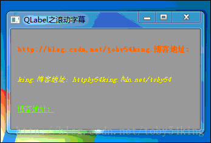

qt字幕滚动是用来处理大量英文的显示和按钮来服务的，一共分为4步


**1 构造一个QString**
构造一个QString用来给qlabel或者qpushbutton来设置text。需要注意的是，qlabel默认居左显示，qpushbutton默认居中显示，需要根据目标显示效果分别对两者进行align的重新设置，此处button需要居左显示，故代码如下：
```c++
    qpushbutton_dialog_auto_test_head_left->setStyleSheet("QPushButton{text-align : left;}");
    qpushbutton_dialog_auto_test_head_left->setMaximumWidth(275);
    qpushbutton_dialog_auto_test_head_left->setMinimumWidth(275);
```
*需要注意的是把这个控件的宽度给定，否则无法实现滚动效果*


**2 构造一个QTimer**
构造一个QTimer用来定时给控件的文本进行刷新，定时器超时时间设置为200-300ms之间，此处重点说明超时槽函数
```c++
void dialog_auto_test::on_strhead_scroll()
{
    static int pos = 0;
    if(pos > m_str_head.length())
        pos = 0;

    qpushbutton_dialog_auto_test_head_left->setText(m_str_head.mid(pos) + m_str_head.left(pos));
    pos++;
}
```
*需要注意的是mid和left函数的先后位置不可颠倒，必须如上设置，否则没有滚动效果*


**3 重写eventFilter函数**
```c++
.h 文件
bool eventFilter(QObject *,QEvent *) override;    //注意这里

.cpp 文件
bool dialog_auto_test::eventFilter(QObject *watched, QEvent *event)
{
    if(watched == qpushbutton_dialog_auto_test_head_left)
    {
        if(event->type() == QEvent::FocusIn)
        {
            qDebug()<<"qpushbutton_dialog_auto_test_head_left in";
            m_qtimer->start(200);
        }
        else if(event->type() == QEvent::FocusOut)
        {
            m_qtimer->stop();
            qpushbutton_dialog_auto_test_head_left->setText(m_str_head);
        }
    }
    return QDialog::eventFilter( watched, event);
}
```
*需要注意的是，此处必须有返回值，且是QDialog还是QWidget根据此时继承与哪个基类进行改写*


**4 安装eventFilter**
```c++
qpushbutton_dialog_auto_test_head_left->installEventFilter(this);
```


**5 滚动效果预览**
```c++
ui->label->setText(m_labelTitle.mid(pos)+
     m_labelTitle.left(pos));

     ui->label_2->setText(m_labelTitle.right(pos)+
    m_labelTitle.left(m_labelTitle.length()-pos));

    ui->label_3->setText(m_labelTitle.left(pos));
--------------------- 
作者：ISmileLi 
来源：CSDN 
原文：https://blog.csdn.net/toby54king/article/details/78636704 
版权声明：本文为博主原创文章，转载请附上博文链接！
```




