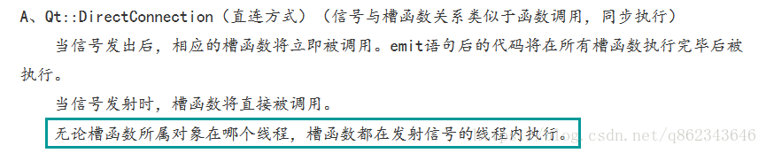

多说无益，直接上代码

# 1 普通的信号槽

```c++
//thread_fuxe.h
#ifndef THREAD_FUSE_H
#define THREAD_FUSE_H
#include <QObject>  //注意一定要包含QObject并且作为基类进行继承
class thread_fuse : public QObject
{
    Q_OBJECT
public:
    explicit thread_fuse(HI_U32 src_width, HI_U32 src_height, HI_U32 des_width, HI_U32 des_height, QObject *parent = nullptr);
    ~thread_fuse() override;
signals:

public slots:
    void  thread_fuse_run();
    void    on_timer_out();  //注意槽函数需要进行实现
}

//thread_complex.h
#ifndef THREAD_COMPLEX_TASK_H
#define THREAD_COMPLEX_TASK_H
#include <QObject>

class thread_complex_task : public QObject
{
    Q_OBJECT
public:
    explicit thread_complex_task(QObject *parent = nullptr);
    ~thread_complex_task() override;

signals:
    void            signal_change_time();
    void            signal_usb_status();
    void            signal_usb_flash_list();

public slots:
    void            on_change_timer_disk();
}

//widget_avm.h
#ifndef WIDGET_AVM_H
#define WIDGET_AVM_H
#include <QWidget>
class widget_avm : public QWidget
{
    Q_OBJECT
public:
    explicit widget_avm(int width, int height, QWidget *parent = nullptr);

signals:
    void    sinnal_start_fuse_thread();
    void    signal_call_show();

public slots:
    void        on_change_time_function();
    void        on_recvs_usb();
    void        on_usb_flash_list();
```

代码已经写完，现在开始正餐

**主线程和子线程之间**
```c++
auto tasks          = new thread_complex_task;
connect(tasks, SIGNAL(signal_change_time()),   this, SLOT(on_change_time_function()));
connect(tasks, SIGNAL(signal_usb_status()),    this, SLOT(on_recvs_usb()));
connect(tasks, SIGNAL(signal_usb_flash_list()),this, SLOT(on_usb_flash_list()));

```
函数的第一个和第三个函数分别代表发送信号和接受信号并相应槽函数的对象，其实connet函数还有第五个参数

1、Qt::AutoConnection： 默认值，使用这个值则连接类型会在信号发送时决定。如果接收者和发送者在同一个线程，则自动使用Qt::DirectConnection类型。如果接收者和发送者不在一个线程，则自动使用Qt::QueuedConnection类型。

2、Qt::DirectConnection：槽函数会在信号发送的时候直接被调用，槽函数运行于信号发送者所在线程。效果看上去就像是直接在信号发送位置调用了槽函数。这个在多线程环境下比较危险，可能会造成奔溃。

3、Qt::QueuedConnection：槽函数在控制回到接收者所在线程的事件循环时被调用，槽函数运行于信号接收者所在线程。发送信号之后，槽函数不会立刻被调用，等到接收者的当前函数执行完，进入事件循环之后，槽函数才会被调用。多线程环境下一般用这个。

4、Qt::BlockingQueuedConnection：槽函数的调用时机与Qt::QueuedConnection一致，不过发送完信号后发送者所在线程会阻塞，直到槽函数运行完。接收者和发送者绝对不能在一个线程，否则程序会死锁。在多线程间需要同步的场合可能需要这个。

5、Qt::UniqueConnection：这个flag可以通过按位或（|）与以上四个结合在一起使用。当这个flag设置时，当某个信号和槽已经连接时，再进行重复的连接就会失败。也就是避免了重复连接。

不管是使用那种方式，要想在子线程里面触发的信号的槽函数在子线程执行，信号槽连接必须使用DirectConnection 方式；


**子线程和子线程**

此处子线程和子线程我主要说明两种，一种是两个子线程都在主线程中进行实例化，并且在使用connect函数前均实例化完成，此时，两个子线程间是可以通信的，范例如下：
```c++
    auto qthread_back   = new QThread;
    auto tasks          = new thread_complex_task;
    tasks->moveToThread(qthread_back);
    connect(tasks, SIGNAL(signal_change_time()), this, SLOT(on_change_time_function()));
    connect(tasks, SIGNAL(signal_usb_status()), this, SLOT(on_recvs_usb()));
    connect(tasks, SIGNAL(signal_usb_flash_list()), this, SLOT(on_usb_flash_list()));
    qthread_back->start();

```
此方法中qthread_back和tasks间就是典型的两个子线程进行了通信，然而在近期的项目中需要的不是这么简单的子线程通信，因为不可能所有需要进行通信的子线程都在主线程进行初始化，这个很明显是不可能的，所以需要使用如下的方式：
```c++
//全局的单例类函数
#ifndef GLOBAL_SET_H
#define GLOBAL_SET_H
#include <QObject>
#include <QMutex>
#include <QStringList>
#include <QReadWriteLock>
#include "common_sys_struct.h"
class common_sys_config : public QObject
{
    Q_OBJECT
public:
    static  common_sys_config   *get_inst();
    static  QReadWriteLock      *get_lock();
    static  QReadWriteLock      *get_vdec_lock();
    void    send_test(){
	emit signal_common_sys_test();
};

private:
    explicit                    common_sys_config(QObject *parent = nullptr);
    static common_sys_config    *m_globalset;
    static QMutex               m_mutex;

    //唤醒键flag的读写锁
    static QReadWriteLock       *m_global_rwlock;

    //解码播放部分读写锁
    static QReadWriteLock       *m_global_vdec_rwlock;

Q_INVOKABLE void comm_test(){
	emit signal_common_sys_test();
};

signals:
    void    signal_common_sys_test();
public slots:
};
#endif // GLOBAL_SET_H

//目标中需要接收信号的类
connect(common_sys_config::get_inst(), SIGNAL(signal_common_sys_test()), this, SLOT(test()));

//目标中需要发送信号的类
common_sys_config::get_inst()->send_test();
```
上述代码中，接受信号的类是thread_venc,需要发送信号的类是thread_fuse，从两者的函数功能来看，明显不可能全部实例化在同一个主线程中，所以通过全局的单例类来进行以此信号的转播，需要注意的是，槽函数所在的类中不能存在耗时函数，比如while循环，否则此方式需要使用五种连接方式中的Qt::DirectConnection，可是此方式对于多线程的Qt来说过于危险，轻则丢失信号，
重则程序崩溃，所以此时一定要弃用while，经过验证，使用QTimer的定时器，到时后触发槽函数运行程序可以和while相似的效果，而且使用安全的Qt::QueuedConnection即可进行响应

**2019.03.28更新**

针对上述程序中无法响应的原因，因为读取大文件要很长时间（比如此时的while死循环），事件循环一直等待函数返回，这样导致阻塞事件循环。结果，GUI线程所有的绘制和交互都被阻塞在事件队列中，所以这个线程是无法响应槽函数的，解决办法是手动

# 2 Q_INVOKABLE与invokeMethod

代码直接上面就有，需要强调两部分，发送信号的部分：
```c++
QMetaObject::invokeMethod(common_sys_config::get_inst(), "comm_test", Qt::QueuedConnection);

```

使用Q_INVOKABLE来修饰成员函数，目的在于被修饰的成员函数能够被元对象系统所唤起：
```c++
Q_INVOKABLE void comm_test(){
	emit signal_common_sys_test();
};

```

**此方式需要注意的是，无论是Qt::DirectConnection还是Qt::QueuedConnection，只要槽函数所在的线程中存在耗时操作，槽函数均不进行响应，Q_INVOKABLE与QMetaObject::invokeMethod均由元对象系统唤起。这一机制在Qt C++/QML混合编程，跨线程编程，Qt Service Framework 以及 Qt/ HTML5混合编程以及里广泛使用。**

# 3 事件驱动

未经实验，参考https://blog.csdn.net/Amnes1a/article/details/64906910