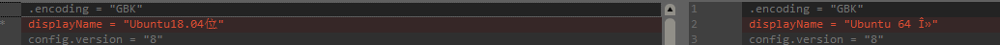
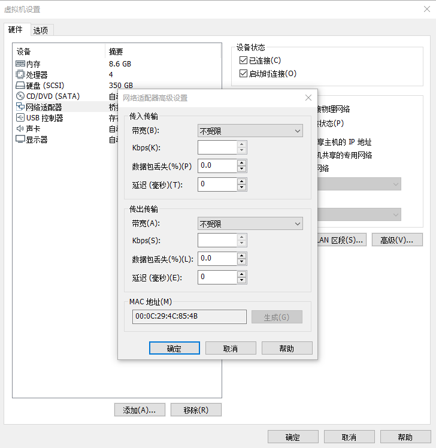

此记录编写于救回来的linux之中，所以，此方法肯定是成功的了。下面是恢复过程：

**问题1** 

丢失了xxx.vmx文件。

本人试过一行一行对照其他好用的文件来修改本损坏文件，但是均以失败告终，在尝试过多次后，猜测应该是与编码有关（虽然文件写明是gbk编码）



左边是错误的，右边图片是正常的，目前的解决方法只有拷贝正常的文件然后不修改中文部分。

**问题2**

父虚拟磁盘已被修改。父虚拟磁盘的内容 ID 与子虚拟磁盘中相应的父内容 ID 不匹配

原因是磁盘文件有xxx.vmdk  xxx-0001.vmdk xxx-0002.vmdk等多个，而去打开父磁盘造成的。解决办法是vim打开mdk文件（仅限linux，windows应该使用ue打开，也只有ue能打开），修改其CID连接

```c++
vi A8-000002.vmdk# 
Disk DescriptorFile
version=3
encoding="UTF-8"
CID=1cbf76d9
parentCID=9a8f79eaisNativeSnapshot="no"
createType="vmfsSparse"
parentFileNameHint="A8-000001.vmdk"
# Extent description
RW 314572800 VMFSSPARSE "A8-000002-delta.vmdk"

vi A8-000001.vmdk
# Disk DescriptorFile
version=3
encoding="UTF-8"
CID=9a8f79ea
parentCID=788a5e7eisNativeSnapshot="no"
createType="vmfsSparse"
parentFileNameHint="A8.vmdk"
# Extent description
RW 314572800 VMFSSPARSE "A8-000001-delta.vmdk"

cat A8.vmdk
# Disk DescriptorFile
version=3
encoding="UTF-8"
CID=788a5e7e
parentCID=1cbf76d9
isNativeSnapshot="no"
createType="vmfs"

# Extent description
RW 335544320 VMFS "A8-flat.vmdk"
```

---------------------------------------------------------------

20190622更新：

注意使用此方法还有个问题就是网络，主要影响的是mac地址，然后造成ip跟原来的不一样（也即成了拷贝的虚拟机vmx的地址而不是我们想要的地址）。出现此问题只能去先前备份的虚拟机的log中进行查找，如果没有备份的话，真的只能再次重新生成了。下面是可以更改的方式（直接更改vmx文件经过验证是不可行的）。

113559.1561174600278.png)


参考文章：

https://www.cnblogs.com/shiningrise/archive/2012/12/24/2831132.html

https://blog.csdn.net/gaixicui0411/article/details/78672787